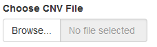
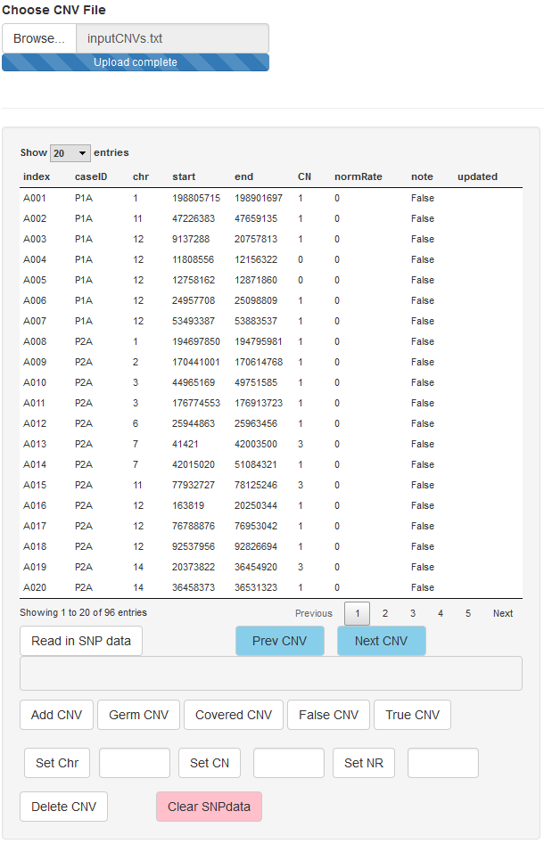
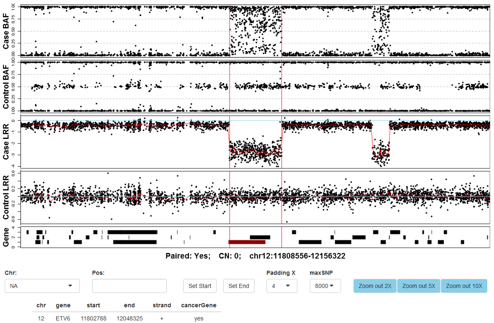
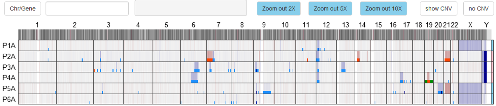
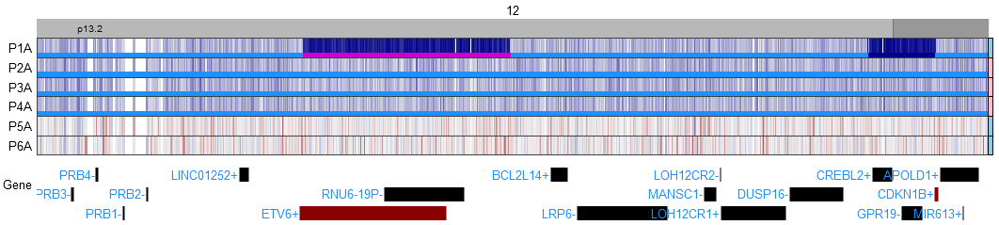

ShinyCNV
================

A Shiny/R application to view and annotate copy number variations
-----------------------------------------------------------------

ShinyCNV is developed by wrapping up the graphics and data-table processing functions in R packages, and the interactive features are provided from the Shiny package. Users can visually check normalized SNP data (either from Illumina or Affymetrix platform) together with reported CNVs from any CNV detection tools, and semi-atomically edit and update the CNVs. Detailed steps are listed below and a video tutorial is also available on [YouTube](https://youtu.be/EQrsyyQFHqA).

Installation
------------

1.  Install [R environment](https://www.r-project.org/)
2.  Install [RStudio](https://www.rstudio.com/).
3.  Install ShinyCNV
    -   Download the updating ShinyCNV by clicking the green button  or the released stable versions. Chrome, IE explorer and Firefox were tested, and other browsers should work too. The example data includes SNP data on chr12 and chrY from 6 cases (`P1 to P6, *A is tumor and *C is control; P6A is unpaired, and P4C is used as a fake control`).
    -   Unzip the ShinyCNV package and open either "ui.R" or "server.R" in RStudio
    -   Click "Run App" button at the top-right corner, the availability of relied R packages will be automatically checked and installed.
    -   After successful installation, you should be able to see this without error:

    

    **NOTE: This app is optimized for full-screen mode and the width of the screen is ideally wider than 1,800 pixels.**

Input files
-----------

1.  Normalized SNP data
    -   Same input file for [OncoSNP](https://sites.google.com/site/oncosnp/user-guide/input-files). The following 5 columns are required:
        -   SNP Name
        -   Chr
        -   Position
        -   Log R Ratio
        -   B Allele Freq
    -   Detailed steps on preparing [**Illumina**](http://penncnv.openbioinformatics.org/en/latest/user-guide/input/) and [**Affymetrix**](http://penncnv.openbioinformatics.org/en/latest/user-guide/affy/) data are available from PennCNV's website.
2.  Reported CNV regions
    -   The reported CNVs could be called by software, as long as the following columns are provided (use the exact same column names):
        -   index `/CNV ID; assigned  by users, which is used to compare the updated CNVs with the original ones`
        -   caseID `/case ID; SNP data file is caseID.{suffix}`
        -   controlID `/control ID; SNP data file is control.{suffix}; for unpaired cases, use other control`
        -   chr `/chromosome`
        -   start `/CNV start position`
        -   end `/CNV end position`
        -   CN `/copy number`
        -   normRate `/normal sample contamination rate; set 0 if unknown`
        -   gender `/Female or Male; set 'Unknown' if unknown`
        -   paired `/Yes or No`

Annotate CNV table
------------------

Before loading the CNV table, make sure proper human genome build version is selected!
Click the "Browse" button to import the CNV table:

Within this panel, you could:

-   select a CNV segment by clicking
-   read in SNP data based on the imported case ID and control ID, **which could be very slow!!!**
-   use "Prev/Next CNV" button to navigate the selected CNV
-   add/delete CNV
-   mark selected CNV as germline/covered/false/true by clicking the buttons
-   set chr/copy number(CN)/normRate(NR); "set chr" is only for newly added CNVs
-   clear the imported SNP data, be cautious on doing this

Check CNVs and update their breakpoints
---------------------------------------

The most useful function of this app is to manually check each CNV and adjust inaccurate breakpoints, which is in the BAF/LRR panel as below:

-   This figure will be shown once CNV "A004" is selected. Each dot represents a SNP probe, with X axis along chromosome coordination and Y axis showing normalized LRR and BAF.
-   Two red vertical lines indicate the reported breakpoints of selected CNV, which is obviously correct according to the figure.
-   The RefSeq genes are shown as bars at the bottom panel, and the COSMIC cancer genes are marked in red. Detailed gene information could be checked by clicking. E.g., the red bar is clicked and the information of gene *ETV6* is shown at the bottom.
-   To change the breakpoints of selected CNV, users could zoom in BAF/LRR graph by mouse-swiping and zoom out through the "Zoom out 2/5/10X" buttons. After clicking a potential breakpoint in BAF/LRR panel, chromosome position of the SNP nearest to the clicked spot will be shown in box "Pos:" and the start/end positions could be updated by "Set Start/End" buttons.
-   In case of marking whole chromosome gain/loss, users need the start and end positions of that chromosome. To do this, the dropdown list "Chr:" is very handy. Usually the start of each chromosome is 1, but for chromosome 13, 14, 15, 21 and 22, the P arm is not assessable and thus would start from cytoband after centromere.
-   “Padding X” drop-list is for adjusting the length of padding regions around the CNV
-   “maxSNP” drop-list is for setting maximum number of SNPs shown in each BAF/LRR panel

CNV spectrum for imported samples
---------------------------------

After loading SNP data, LRR across genome will be shown in the spectrum panel below:

-   Blue means LRR is below 0 (copy number loss) while red means above 0 (copy number gain).
-   Case IDs are on the left side and chromosomes are on the top.
-   Genders are marked at the right side: pink for female; skyblue for male.
-   Based on LRR intensity on X and Y chromosomes, gender information could be checked.
-   Within this panel, mouse-swiping zoom in is **NOT** supported.
-   “Show CNV” and “Hide CNV” buttons are provided to show and hide the imported CNVs as bars at the bottom of each sample.
    -   copy-neutral loss of heterozygosity: **green** 
    -   1 copy loss: **light blue** 
    -   2 copy loss (0 copy left): **dark blue** 
    -   1 copy gain: **red** 
    -   2 or more copy gain: **dark red** 
    -   selected CNV (see below): **magenta** 

Users could navigate to specific chromosome, gene, region through input box "Chr/Gene":

-   "Chr/Gene" accepts:
    -   chromosomes: "1-22, X, Y"
    -   gene symbol: e.g. "TP53"
    -   region: "12:11329569-13134790"
-   The input type is automatically detected, and if it cannot fit into any of the 3 types, whole genome spectrum will be shown.
-   Within the figure, mouse-swiping zoom in is supported.
-   Genes from RefSeq are shown as bars at bottom, and the COSMIC cancer genes are highlighted in red.
-   This figure is useful for checking key focal lesions like *IKZF1*, *CDKN2A/B*, *PAX5* etc.

###### ----------------------------END----------------------------
